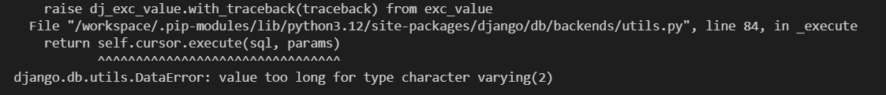
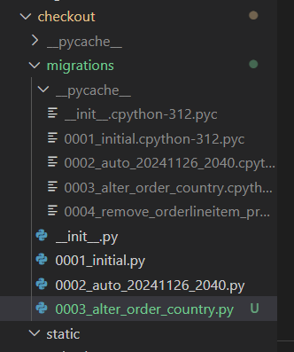
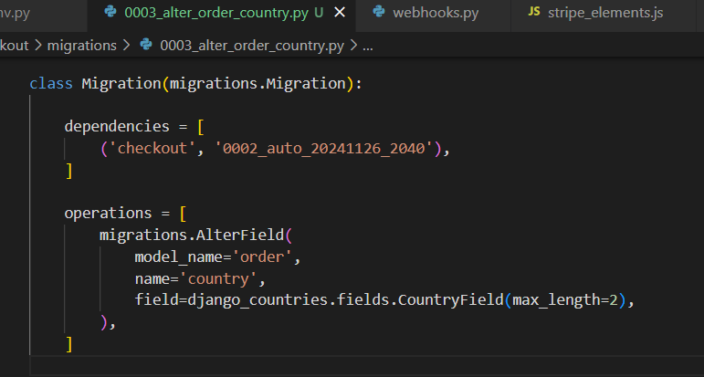

# GoFit 

### GoFit!

There are a lot of gym membership website but I made this a little different. I did a little research, correct me if I am wrong but I have not seen any fitness gym website that offeres membership to use the gym facility, join classes and the site is also a shopping site that users/member/non member could buy healthy options of meals, snacks and drinks. 

## Table of Contents

- [GoFit](#go-fit)
  - [Table of Contents](#table-of-contents)
  - [**UX**](#ux)
    - [**Site Purpose**](#site-purpose)
    - [**Site Goal**](#site-goal)
    - [**Current User Goal**](#current-user-goal)
  - [**Design**](#design)
    - [**Colour Palette**](#colour-palette)
    - [**Typography**](#typography)
    - [**Images**](#images)
  - [**Features**](#features)
    - [**Language Used**](#language-used)
    - [**Navigation Bar**](#navigation-bar)
    - [**Landing Page**](#landing-page)
    - [**Footer**](#footer)
    - [**Future Features**](#future-features)
  - [**Testing**](#testing)
    - [**HTML Validatior Test**](#html-validatior-test)
    - [**CSS Validator Test**](#css-validator-test)
    - [**Lighthouse Mobile**](#lighthouse-mobile)
    - [**Libraries and Progransms used**](#libraries-and-progransms-used)
  - [**Deployment & Usage**](#deployment--usage)
    - [**Deployment**](#deployment)
  - [**Credits**](#credits)
    - [**Media**](#media)

## **UX**

### **Site Purpose**

### Website Purpose:
#### What For:
The Website is like any other gym membership website but what set this aside is that not only that it offers gym membership but it has a shopping page where users member or not can shop and purchase healthy meals, snacks and drinks. 

- Navbar - Navbar is visible to all pages and shows a basic navigation functionality. 
  Main page/Features
  •	Dynamic and Simple navigation bar that allows users to be able to select and view categories base on what they want to check and find out
  •	The logo itself is a clickable link where the users are directed back to the home page without clicking the back button.
  •	We have the Visible sign up/ Log in links(Explanatory)
  •	Simple image that shows what the website it, what it is for and who are target audience are. 
  •	Navbar has a few options that they could browse and have a look around

-	Index / Home Page  – Basic concept, with direct approach showing what the website is and who the target audience are. We have some banner on the top which viewers can clearly see promotions from the site. A visible and not too complicated SignUp/LogIn link that directs to respective pages. 

  Short descriptive and encouraging line for custoomers to click the link signup. 
  The GoFit logo is a clickable navbar brand that routes the user to back to home page this works in other pages too. 

-	SignUp Page – Offers a direct approach on the registration process, nothing too complicated with prompts to let the user know what they would need to be able to create a profile. Once they are satisfied with the input they have selected and created, pressing the Register Button stores their information to the Data Base and routes them to their profile page where they can see their information and as well as update their contact information such email and phone number. Pressing the "Go to Request" button routes them to the request they have created. Which the Admin will be able to see from their page. The Request button takes them to the "Travel Request form" where they can fill in base on their needs and preferrence. 

- Log in Page - Users can log-n using their credentials when they already have an account registered. 

- Membership Page - Page shows the membership categories that the gym is offering, it shows the name, price and a little description about the membership.
    •	The membership offers tab is where all the membership information is displayed. Information about the type of membership we have
    •	A simple and self-explanatory page, which users can easily understand and get information about what type of membership we have. This page also features other discounted offers base on the business needs. 
    •	There is a visible clickable button (SELECT THIS MEMBERSHIP) that routes the user to the sign up page that take their information
    •	After signing up they will then be directed to their Profile page. 

- Membership Detail Page - User is being directed to this page when they select the membership from the Membership Page, this page shows the full information about the membership, including what is included in the membership and what facilities and classes they could join. 

- Book Classes Page - This page shows list of classes that are available within the week. Member and none member can access / see this page however only the member can choose and join any classes that are listed on the page. Non member customers are being routed to the SignUp page when they click join button. 

- GoFit Shop Page - This page is a connected shopping site where member or non member can browse around and purchase healthy meals, snacks and drinks.

- Facility Gallery Page - This page shows the facility Images that the customer can browse around, this features fantastic facilites that will intice customers to signup.

- Footer - The same as the navbar is also accessible accross all pages. Footer is where users can see the company's contact information and social networks. 

- Contact Page - This Page is available and visible both when login and or from the Index Page, giviing the users that have not registered yet opportunity to contact admins for questions that may have. This is also visible when logged in when members would also like to reach out with the Admin for help or other inquiries that they may have. 

- Logout -  This functionality is available under the dropdown list insdie the Manage Account Selection of the Navbar
- The site has a Admin capability once logged in as a admin, the admin can add products in GoFit Shop, add membership category in Membership Offers Page and also add Classes to the Book Classes Page. The admin also has the ability to delete and update any products, membership and classes. 

#### Who For: 
The Website is for customers who are gym goers who value the quality of the facility, classes , membership and products. 

### **Site Goal**

Site Goal is to provide a one stop shop for Gym Goers the site offers a wide range services

### **Current User Goal**
- Working buttons that routes users to the appropriate page 
- Admin fucntionality CRUD 
- Contact Us
- Stripe safe payment

## **Design**
### **Colour Palette**
  I have kept it simple as possible not too many colors complicating the visuals
  White, Black, Grey
  Buttons - Green, Red and Blue

### **Typography**
  Playfair", sans-serif;
  Georgia, 'Times New Roman', Times, serif;

### **Images**
#### Home Page / Carousel / 
- Shuttershock 

#### Registration Page:/Login Page:/Travel Req Page:
- Shuttershock (Paid Subscription)

#### Logo
- Adobe Logo (Paid Subscription)

## **Features**
### NAVIGATION BAR ON ALL PAGES WITH ACTIVE HIGHLIGH

   -  My very first project with Code Institute was a Blog Site and I mentioned there that I think the most important thing about a website is the navigation bar, to me it should not be complicated to use it and it should be visible with easy to the eyes color. My navbar turns into a toggle button when the screen size go smaller. The Navigation bar also highlights what page the user is currently in. Up until today, this is still something I think should be necessary nothing beats simplicity  

### SOCIAL LINKS

  - In this day and age, Social Media is everywhere and 99% of the population probably has one, so having social links on all pages of your website not only makes your website look aesthestically pleasing but as well as it could help users find your easier. Especially when you are offering services. 

  The Links are not working because I do not want to connect any of my social account

### ADMIN FUNCTIONALITY

  - Apart from going to the Admin in Django, Admins can edit, delete and add anything they need in the website. 

  ### CONTACT PAGE 

  - Contact Pages I think is one of the most usefukl pages in a website, it provides user comfort that they can reach out to someone if they do have additional information. 

  ### SIGN PAGE 

  - This site is for a member only Travel Assistance Site . 

### **Language Used**
  - English 

## **Testing**
### Bugs and Issues

  - #### Code Issues
    
- Allauth installation was not installing even with the 0.41.0 , student care was able to assist me with the providing the most updated allauth which was the 54.0

- Image was not loading because staticfiles path was not a tuple

- Forgot to double the underscore in the views.py to show the categories, only had one underscore causing it to show an error. Had to recheck the walkthrough to compare my work and realized I missed the 2nd underscore. 

- The Sort drop down did not work, realized that I was in the wrong version of bootsrap. Changed my version from 5.0 to 4.6 and used the code from this version and the dropped down worked. 

- When trying to deploy my work to heroku I get an fail to deploy. I googled everywhere but it keeps saying that I did not set up the s3 and iam correctly so I followed the video again and it still getting the same error. I immidietly contacted student support who gave me the updated steps to do the s3 and Iam, this has resolved trhe issue I have been having. 

- The images in my GoFit products are not showing thinking it might have been the url but it isnt. It showing a appended data. What I did is I went to the admin django and removed the image that is currently there and replaced it with the one that is not appended it resolve the issues.

- The imahes in my Facility Gallery are also not showing found out that it is hard coded reason why it showing in local but not the deployed one. tutor support rebecca told me to add this format  {{ MEDIA_URL }}image_name.png but still was not working so 

- remove option was not working, having to look at what was missing on my code. The only thing that solved the problem  was correcting a typo on the script source.

- update and remove button are not working in the deployed site but are working on the local host , I did not do any changes with this resolved by refreshing multiple times and closing the gitpos dev env.

- The scroll up and down in toast is not working - This resolved itself overtime, I somehow made it work but could not figure out what I change to make it work. 

- PROBLEM TO SOLVE"  Stripe Payment field is not showing, this was a miss on my end, it was showing but I could not see it because it was behind the background image. I found out about it when I did a dev tools inspecting it. 

- After installing pip3 install django-countries==7.2.1 and editing the models, tried migrating and it keeps getting this error 
   
   
  
    
 googled this issue and after hours of searching I found this 

  https://stackoverflow.com/questions/8484689/django-form-database-error-value-too-long-for-type-character-varying4

- I could not find what he was saying column max lenght but did find this
I wasn't too sure waht I need to put in there but research about it but couldnt find anything so I bit my tongue and just changed it to 1000 and did the migrate and it WORKED I checked botique ado migrations and its still oon 2 so I was wondering what could have caused it. I changed it back to 2 for now and will have a look into it when I have more time in my hands. 
#PROBLEM TO SOLVE = SIGN UP DOS NOT DIRECT YOU TO THE VERIFY EMAIL PAGE BUT DIRECTS YOU TO THJE MAIN PAGE. EVERYTHIONG LOOKS OKAY BUT FIGURE IT OUT LATER 

### **HTML Validatior Test**

  - GoFit Page - 
https://validator.w3.org/nu/?doc=https%3A%2F%2Fgofit-d18fb7690928.herokuapp.com%2F

  - Membership Offers Page -
https://validator.w3.org/nu/?doc=https%3A%2F%2Fgofit-d18fb7690928.herokuapp.com%2Fmembership%2Fmemberships%2F

  - Book Classes Page - 
https://validator.w3.org/nu/?doc=https%3A%2F%2Fgofit-d18fb7690928.herokuapp.com%2Faccounts%2Flogin%2F%3Fnext%3D%2Ffitness_classes%2F

  - Facility Gallery Page - 
https://validator.w3.org/nu/?doc=https%3A%2F%2Fgofit-d18fb7690928.herokuapp.com%2Fgallery%2Fgallery%2F

  - GoFit Shop Page - 
https://validator.w3.org/nu/?doc=https%3A%2F%2Fgofit-d18fb7690928.herokuapp.com%2Fproducts%2F

  - SignUp Page - 
https://validator.w3.org/nu/?doc=https%3A%2F%2Fgofit-d18fb7690928.herokuapp.com%2Faccounts%2Fsignup%2F

 - LogIn -
https://validator.w3.org/nu/?doc=https%3A%2F%2Fgofit-d18fb7690928.herokuapp.com%2Faccounts%2Flogin%2F

 - Product Detail - 
https://validator.w3.org/nu/?doc=https%3A%2F%2Fgofit-d18fb7690928.herokuapp.com%2Fproducts%2F15%2F

  - Bag Page - 
  https://validator.w3.org/nu/?doc=https%3A%2F%2Fgofit-d18fb7690928.herokuapp.com%2Fbag%2F

  - Membership Detail - 
  https://validator.w3.org/nu/?doc=https%3A%2F%2Fgofit-d18fb7690928.herokuapp.com%2Fmembership%2Fmembership%2Fmembership%2F2%2F

  - Payment Page for Membership -
  https://validator.w3.org/nu/?doc=https%3A%2F%2Fgofit-d18fb7690928.herokuapp.com%2Fmembership%2Fpayment%2F

  - Payment Success Page Membersip - 
  https://validator.w3.org/nu/?doc=https%3A%2F%2Fgofit-d18fb7690928.herokuapp.com%2Fmembership%2Fpayment%2F

  - Product Management -
  https://validator.w3.org/nu/?doc=https%3A%2F%2Fgofit-d18fb7690928.herokuapp.com%2Fproducts%2Fadd%2F

  - Edit Class - 
  https://validator.w3.org/nu/?doc=https%3A%2F%2Fgofit-d18fb7690928.herokuapp.com%2Ffitness_classes%2Fedit%2F2%2F

  - Add Class - 
  https://validator.w3.org/nu/?doc=https%3A%2F%2Fgofit-d18fb7690928.herokuapp.com%2Ffitness_classes%2Fadd%2F

  - Edit Membership Offer - 
  https://validator.w3.org/nu/?doc=https%3A%2F%2Fgofit-d18fb7690928.herokuapp.com%2Fmembership%2Fadd%2F

  - Add Mmbership Offer - 
  https://validator.w3.org/nu/?doc=https%3A%2F%2Fgofit-d18fb7690928.herokuapp.com%2Fmembership%2Fadd%2F 

### **CSS Validator Test**
  - style.css - 

### **JS Validator Test**
  - script
   

  There are still errors in here however these are needed in my code to work

## **Libraries and Programs used**
-  Bootstrap
- Crispu forms
- django
- Github: Store Repositor
- Gitpod: To create the html and css file
- Google Fonts: Font family "Playfair", sans-serif;
- Font Awesome: Dropdown menu icon
- UI.DEV: Responsive screenshots of the final project for the README file
- Squoosh app/editor
- Online image converter
- stackoverflow
- w3 checkers
- js hint
- Stripe payments

## **Deployment & Usage**
### **Deployment**
To deploy my site on Git Hub I made the following steps. I found out how to deploy my project when I was playing around with github trying to fix my incorrect path which hinders my images to load up on live. 

These are the steps:

 - Go to the Settings tab of your GitHub repo.
 - On the left-hand sidebar, in the Code and automation section, select Pages.
 - Make sure: Source is set to 'Deploy from Branch'.
 - Main branch is selected.
 - Folder is set to / (root).
 - Under Branch, click Save.
 - Go back to the Code tab. Wait a few minutes for the build to 
 - finish and refresh your repo.
 - On the right-hand side, in the Environments section, click on 'github-pages'.
 - Click View deployment to see the live site

### **Fork**
  1.  On GitHub.com, navigate to the experience-croatia repository.
  2.  In the top-right corner of the page, click Fork.
  3.  Under "Owner," select the dropdown menu and click an owner for the forked repository.
  4.  By default, forks are named the same as their upstream repositories. Optionally, to further distinguish your fork, in the "Repository name" field, type a name.
  5.  Optionally, in the "Description" field, type a description of your fork.
  6.  Optionally, select Copy the DEFAULT branch only.
  7.  Click Create fork.

### **Cloning**
  1.  On GitHub.com, navigate to your fork of the Spoon-Knife repository.
  2.  Above the list of files, click  Code.
  3.  Copy the URL for the repository.
    - To clone the repository us
    itory using an SSH key, including a certificate issued by your organization's SSH certificate authority, click SSH, then click .
    - To clone a repository using GitHub CLI, click GitHub CLI, then click .
  4.  Open Git Bash.
  5.  Change the current working directory to the location where you want the cloned directory.
  6.  Type git clone, and then paste the URL you copied earlier. It will look like this, with your GitHub username instead of YOUR-USERNAME:
  7.  Press Enter. Your local clone will be created.

## **Credits**
 - Stackoverflow 
 - Code Institute Botique ado was the basis of my work especially the shopping part, I started with that to practice and get into the flow of making aps in django. 
- compressing Images
  - https://squoosh.app/

- Confirmation Page Idea (This is will be made interactive during Java script milestone)
The Idea is to make the contact page look interactive and to show the benefits of it. 
  -  Daniel Hamilton

- Embed video instructions from
  - Code Institue 
  - W3schools
  - Youtube
  - Geeks for geeks 

### **Media**

Media are either personal Photos or paid subscription from shutterstock. 
  
