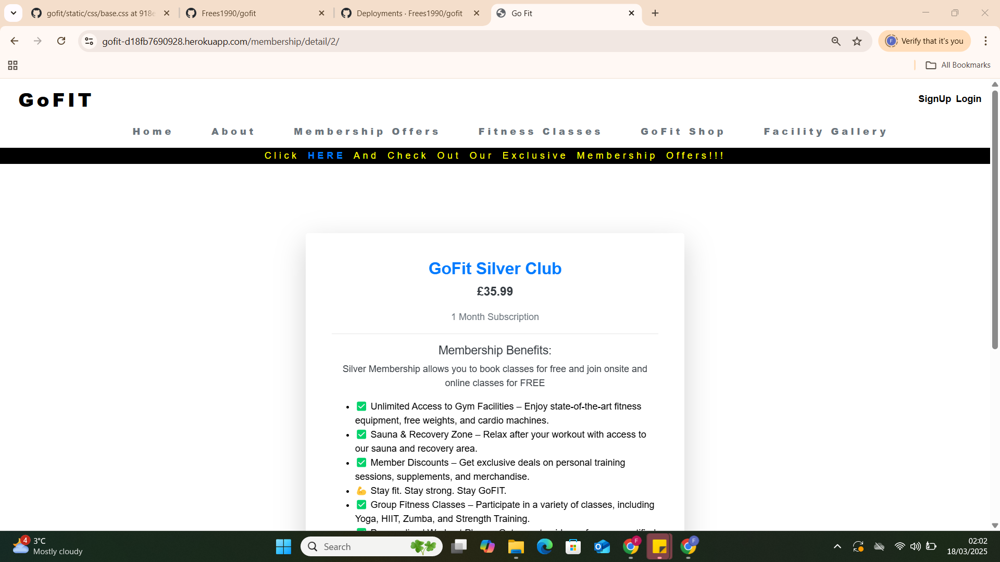
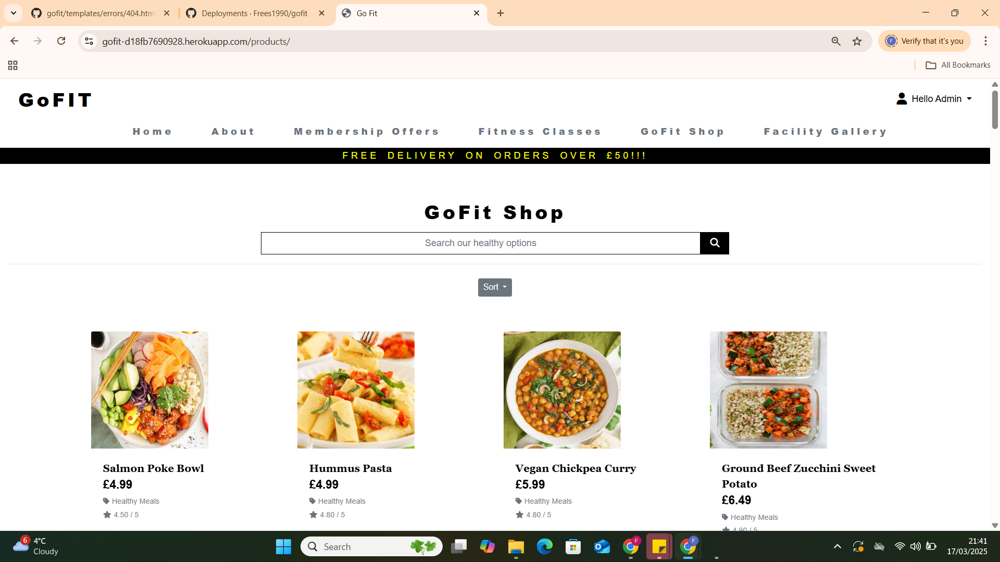
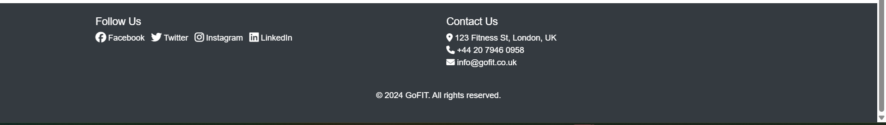

# GoFit 

### GoFit!

My Site is a combination of Gym Membership and Health Shop where they could See information about Prices of the Membership, Learn about the Facility and as well browse through Healthy Options. 

## Table of Contents

- [GoFit](#go-fit)
  - [Table of Contents](#table-of-contents)
  - [**UX**](#ux)
    - [**Site Purpose**](#site-purpose)
    - [**Site Goal**](#site-goal)
  - [**Design**](#design)
    - [**Colour Palette**](#colour-palette)
    - [**Typography**](#typography)
    - [**Images**](#images)
    - [**Language Used**](#language-used)
    - [**Navigation Bar**](#navigation-bar)
    - [**Landing Page**](#landing-page)
    - [**Footer**](#footer)
    - [**Future Features**](#future-features)
  - [**Deployment & Usage**](#deployment--usage)
    - [**Deployment**](#deployment)
  - [**Credits**](#credits)
    - [**Media**](#media)

## **UX**

### **Site Purpose**

### Website Purpose:
#### What For:
The Website is like any other gym membership website but what set this aside is that not only that it offers gym membership but it has a shopping page where users member or not can shop and purchase healthy meals, snacks and drinks. 

- Navbar - Navbar is visible to all pages and shows a basic navigation functionality. 

  Main page/Features
  •	Dynamic and Simple navigation bar that allows users to be able to select and view categories base on what they want to check and find out
  •	The logo itself is a clickable link where the users are directed back to the home page without clicking the back button.
  •	We have the Visible sign up/ Log in links
  •	Simple image that shows what the website is forand the target audience. 
  •	Navbar has a few options that they could browse and have a look around.

-	Index / Home Page  

 Basic concept, with direct approach showing what the website is and who the target audience are. A visible and not too complicated SignUp/LogIn link that directs to respective pages. 
 

- Log in Page 
  
  Users can log-n using their credentials when they already have an account registered. 

- Membership Page
  
  Page shows the membership categories that the gym is offering, it shows the name, price and a little description about the membership.
    •	The membership offers tab is where all the membership information is displayed. Information about the type of membership we have
    •	A simple and self-explanatory page, which users can easily understand and get information about what type of membership we have. This page also features other discounted offers base on the business needs. 

- Membership Detail Page 

  User is being directed to this page when they select the membership from the Membership Page, this page shows the full information about the membership, including what is included in the membership and what facilities and classes they could join. 

- Fitness Classes Page 

  This page shows list of classes that are available within the week.

- GoFit Shop Page

 This page is a connected shopping site where member or non member can browse around and purchase healthy meals, snacks and drinks.

- Facility Gallery Page 

This page shows the facility Images that the customer can browse around, this features fantastic facilites that will intice customers to signup.

- Footer 

 The same as the navbar is also accessible accross all pages. Footer is where users can see the company's contact information and social networks. 

- The site has a Admin capability once logged in as a admin, the admin can add products in GoFit Shop, add membership category in Membership Offers Page and also add Classes to the Book Classes Page. The admin also has the ability to delete and update any products, membership and classes. 

#### Who For: 
The Website is for customers who are gym goers who value the quality of the facility, classes , membership and products. 

### **Site Goal**

Site Goal is to provide a one stop shop for Gym Goers the site offers a wide range services

## **Design**
### **Colour Palette**
  I have kept it simple as possible not too many colors complicating the visuals
  White, Black, Grey
  Buttons - Green, Red and Blue

### **Typography**
  Playfair", sans-serif;
  Georgia, 'Times New Roman', Times, serif;

### **Images**
#### Home Page
- Shuttershock 

### **Language Used**
  - English 

## **Libraries and Programs used**
-  Bootstrap
- Crispu forms
- django
- Github: Store Repositor
- Gitpod: To create the html and css file
- Google Fonts: Font family "Playfair", sans-serif;
- Font Awesome: Dropdown menu icon
- UI.DEV: Responsive screenshots of the final project for the README file
- Squoosh app/editor
- Online image converter
- stackoverflow
- w3 checkers
- js hint
- Stripe payments

## **Deployment & Usage**
### **Deployment**
To deploy my site on Git Hub I made the following steps. I found out how to deploy my project when I was playing around with github trying to fix my incorrect path which hinders my images to load up on live. 

These are the steps:

 - Go to the Settings tab of your GitHub repo.
 - On the left-hand sidebar, in the Code and automation section, select Pages.
 - Make sure: Source is set to 'Deploy from Branch'.
 - Main branch is selected.
 - Folder is set to / (root).
 - Under Branch, click Save.
 - Go back to the Code tab. Wait a few minutes for the build to 
 - finish and refresh your repo.
 - On the right-hand side, in the Environments section, click on 'github-pages'.
 - Click View deployment to see the live site

### **Fork**
  1.  On GitHub.com, navigate to the "https://github.com/Frees1990/gofit" repository.
  2.  In the top-right corner of the page, click Fork.
  3.  Under "Owner," select the dropdown menu and click an owner for the forked repository.
  4.  By default, forks are named the same as their upstream repositories. Optionally, to further distinguish your fork, in the "Repository name" field, type a name.
  5.  Optionally, in the "Description" field, type a description of your fork.
  6.  Optionally, select Copy the DEFAULT branch only.
  7.  Click Create fork.

### **Cloning**
  1.  On GitHub.com, navigate to your fork of the Spoon-Knife repository.
  2.  Above the list of files, click  Code.
  3.  Copy the URL for the repository.
    - To clone the repository us
    itory using an SSH key, including a certificate issued by your organization's SSH certificate authority, click SSH, then click .
    - To clone a repository using GitHub CLI, click GitHub CLI, then click .
  4.  Open Git Bash.
  5.  Change the current working directory to the location where you want the cloned directory.
  6.  Type git clone, and then paste the URL you copied earlier. It will look like this, with your GitHub username instead of YOUR-USERNAME:
  7.  Press Enter. Your local clone will be created.

## **Credits**
 - Stackoverflow 
 - Code Institute Botique ado was the basis of my work especially the shopping part, I started with that to practice and get into the flow of making aps in django. 
- compressing Images
  - https://squoosh.app/

- Confirmation Page Idea (This is will be made interactive during Java script milestone)
The Idea is to make the contact page look interactive and to show the benefits of it. 
  -  Daniel Hamilton

- Embed video instructions from
  - Code Institue 
  - W3schools
  - Youtube
  - Geeks for geeks 

### **Media**

Media are either personal Photos or paid subscription from shutterstock. 
  
