# Testing

Return back to the [README.md](README.md) file.

## Code Validation

### HTML

I have used the recommended [HTML W3C Validator](https://validator.w3.org) to validate all of my HTML files.

| Page             | W3C URL                                                                                                    | Screenshot                                                              | Notes                               |
| ---------------- | ---------------------------------------------------------------------------------------------------------- | ----------------------------------------------------------------------- | ----------------------------------- |
| Home             | [W3C](https://validator.w3.org/nu/?doc=https%3A%2F%2Fgofit-d18fb7690928.herokuapp.com%2F   )               |                 | Pass: No Errors                     |
| About            | [W3C](https://validator.w3.org/nu/?doc=https%3A%2F%2Fgofit-d18fb7690928.herokuapp.com%2Fabout%2F)         |                | Pass: No Errors     |
| Membership       | [W3C](https://validator.w3.org/nu/?doc=https%3A%2F%2Fgofit-d18fb7690928.herokuapp.com%2Fmembership%2F)              |           | Pass: No Errors |
| Fitness Classes  | [W3C](https://validator.w3.org/nu/?doc=https%3A%2F%2Fgofit-d18fb7690928.herokuapp.com%2Ffitness_classes%2F)|           | Pass: Info: Trailing slash on void elements has no effect andErrors  |
| GoFit Shop       | [W3C](https://validator.w3.org/nu/?doc=https%3A%2F%2Fgofit-d18fb7690928.herokuapp.com%2Fproducts%2F)     |      | Pass: No Errors                     |
| Gallery          | [W3C](https://validator.w3.org/nu/?doc=https%3A%2F%2Fgofit-d18fb7690928.herokuapp.com%2Fgallery%2F)              |               | Pass: No Errors                     |
| SignUP           | [W3C](https://validator.w3.org/nu/?doc=https%3A%2F%2Fgofit-d18fb7690928.herokuapp.com%2Faccounts%2Fsignup%2F)              |               | Pass: No Errors                     |
| LogIN            | [W3C](https://validator.w3.org/nu/?doc=https%3A%2F%2Fgofit-d18fb7690928.herokuapp.com%2Faccounts%2Flogin%2F)              |               | Pass: No Errors                     |
| Membership Details| [W3C](https://validator.w3.org/nu/?doc=https%3A%2F%2Fgofit-d18fb7690928.herokuapp.com%2Fmembership%2Fdetail%2F2%2F)              |               | Pass: No Errors                     |
| Admin Add Membership | [W3C](https://validator.w3.org/nu/?doc=https%3A%2F%2Fgofit-d18fb7690928.herokuapp.com%2Fmembership%2Fadd%2F)              |               | Info: Trailing slash on void elements has no effect and Errors                     |
| Admin Edit Membership| [W3C](https://validator.w3.org/nu/?doc=https%3A%2F%2Fgofit-d18fb7690928.herokuapp.com%2Fmembership%2Fedit%2F2%2F)              |               | Info: Trailing slash on void elements has no effect and Errors                     |
| Admin Add Fit Class  | [W3C](https://validator.w3.org/nu/?doc=https%3A%2F%2Fgofit-d18fb7690928.herokuapp.com%2Ffitness_classes%2Fadd%2F)              |               | Info: Trailing slash on void elements has no effect and Errors                     |
| Admin Edit Fit Class | [W3C](https://validator.w3.org/nu/?doc=https%3A%2F%2Fgofit-d18fb7690928.herokuapp.com%2Ffitness_classes%2Fedit%2F2%2F)              |               | Info: Trailing slash on void elements has no effect and Errors                     |
| Product Detail       | [W3C](https://validator.w3.org/nu/?doc=https%3A%2F%2Fgofit-d18fb7690928.herokuapp.com%2Fproducts%2Fdetail%2F16%2F)              |               | Pass: No Errors                     |
| Admin Add Product    | [W3C](https://validator.w3.org/nu/?doc=https%3A%2F%2Fgofit-d18fb7690928.herokuapp.com%2Fproducts%2Fadd%2F)              |               |  Info: Trailing slash on void elements has no effect and Errors                     |
| Admin Edit Product   | [W3C](https://validator.w3.org/nu/?doc=https%3A%2F%2Fgofit-d18fb7690928.herokuapp.com%2Fproducts%2Fedit%2F17%2F)              |               | Info: Trailing slash on void elements has no effect and Errors                     |
| Admin/User Profile   | [W3C](https://validator.w3.org/nu/?doc=https%3A%2F%2Fgofit-d18fb7690928.herokuapp.com%2Fprofile%2F)              |               | Info: Trailing slash on void elements has no effect and Errors                    |
| Shop Bag             | [W3C](https://validator.w3.org/nu/?doc=https%3A%2F%2Fgofit-d18fb7690928.herokuapp.com%2Fbag%2F)              |               | Pass: No Errors                     |
| Checkout Bag         | [W3C](https://validator.w3.org/nu/?doc=https%3A%2F%2Fgofit-d18fb7690928.herokuapp.com%2Fcheckout%2F)              |               | Pass: No Errors                     |
| Checkout Success     | [W3C](https://validator.w3.org/nu/?doc=https%3A%2F%2Fgofit-d18fb7690928.herokuapp.com%2Fcheckout%2Fcheckout_success%2F3AAC9EF492AC4CCD809E9FC77074CA9F)              |               | Pass: No Errors                     |

### CSS

I have used the recommended [CSS Jigsaw Validator](https://jigsaw.w3.org/css-validator) to validate all of my CSS files.

| File      | Jigsaw URL                                                                                                       | Screenshot                                                  | Notes           |
| --------- | ---------------------------------------------------------------------------------------------------------------- | ----------------------------------------------------------- | --------------- |
| style.css | [Jigsaw](https://jigsaw.w3.org/css-validator/validator?uri=https%3A%2F%2Fgofit-d18fb7690928.herokuapp.com%2F&profile=css3svg&usermedium=all&warning=1&vextwarning=&lang=en) |  | Pass: No Errors |

### JS
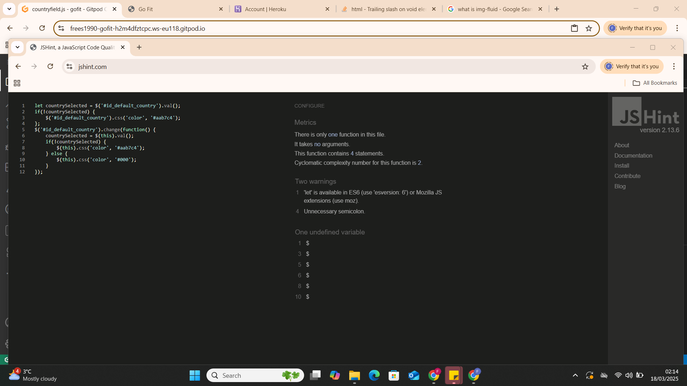 
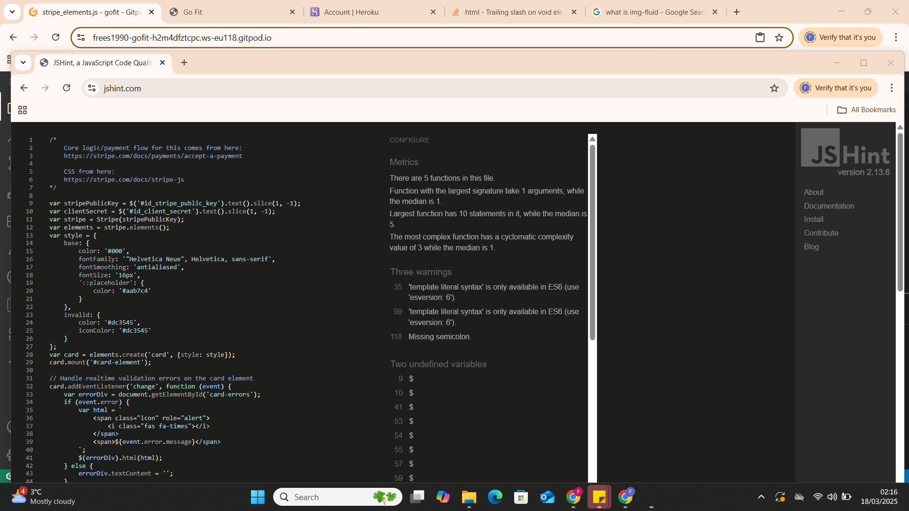 

## Browser Compatibility

I've tested my deployed project on multiple browsers to check for compatibility issues.

| Browser | Screenshot                                             | Screenshot                                                   | Screenshot                                                 | Screenshot                                                     | Notes             |
| ------- | ------------------------------------------------------ | ------------------------------------------------------------ | ---------------------------------------------------------- | -------------------------------------------------------------- | ----------------- |
| Edge  |   |   |   |   | Works as expected |
| Chrome    |     |     |     |     | Works as expected |

## Lighthouse Audit

I've tested my deployed project using the Lighthouse Audit tool to check for any major issues.

| Page             | Size    | Screenshot                                                        | 
| ---------------- | ------- | ----------------------------------------------------------------- |
| Home             | Mobile  | 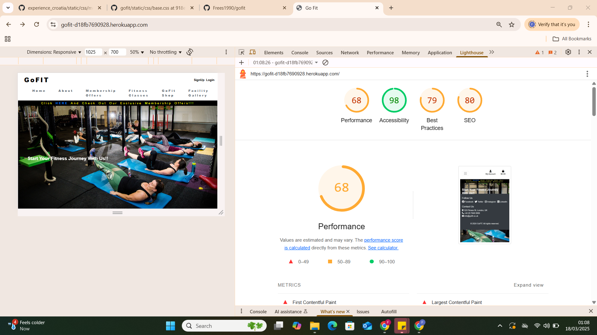                 | 
| Home             | Desktop | 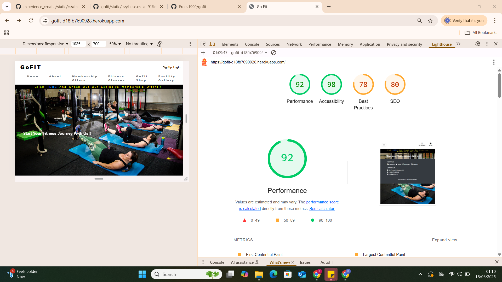                | 
| About            | Mobile  | 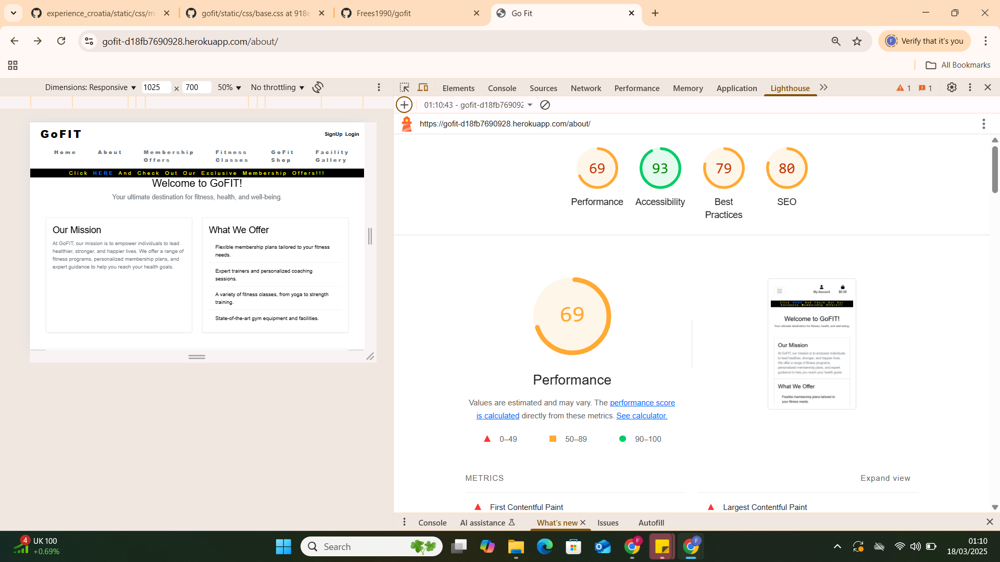                | 
| About            | Desktop | 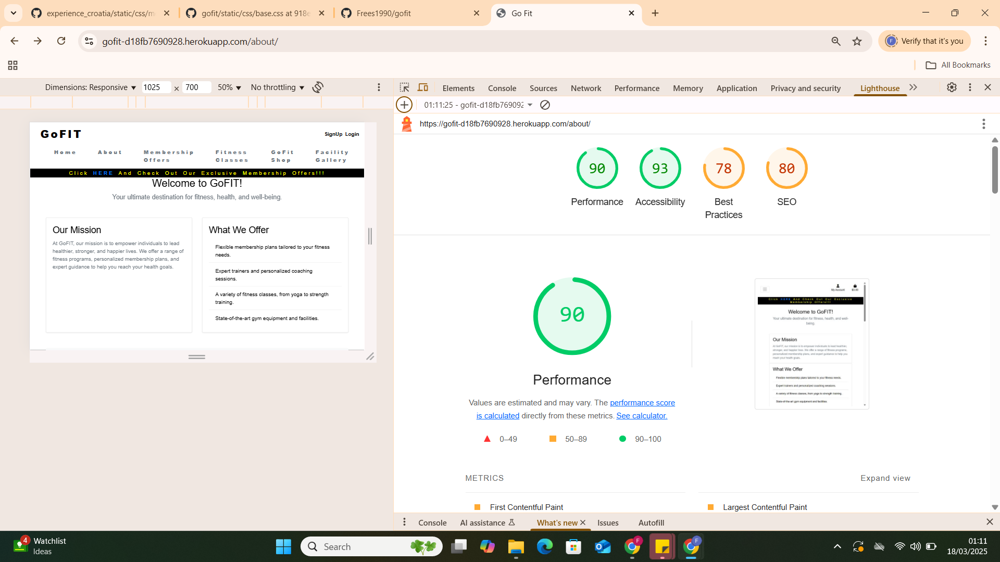               | 
| Membership       | Mobile  | 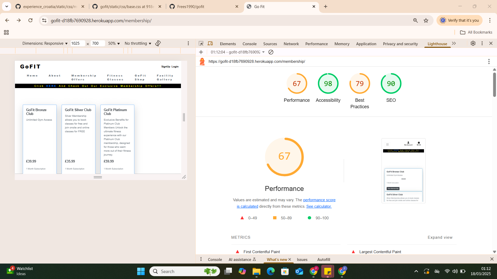    |
| Membership       | Desktop | 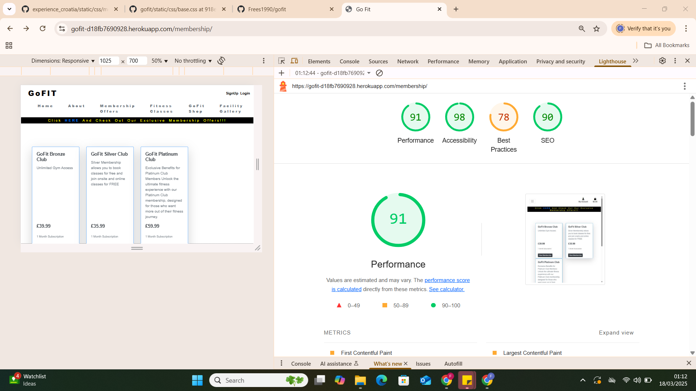                 | 
| Class          | Mobile  |  |
| Class          | Desktop | 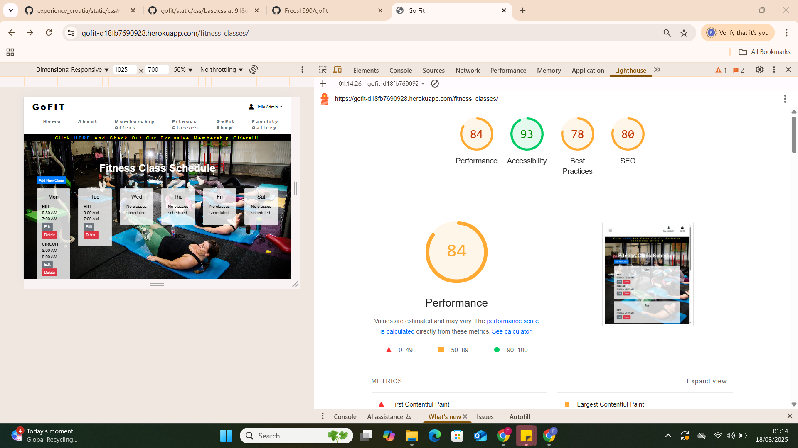 |
| Shop          | Mobile  | 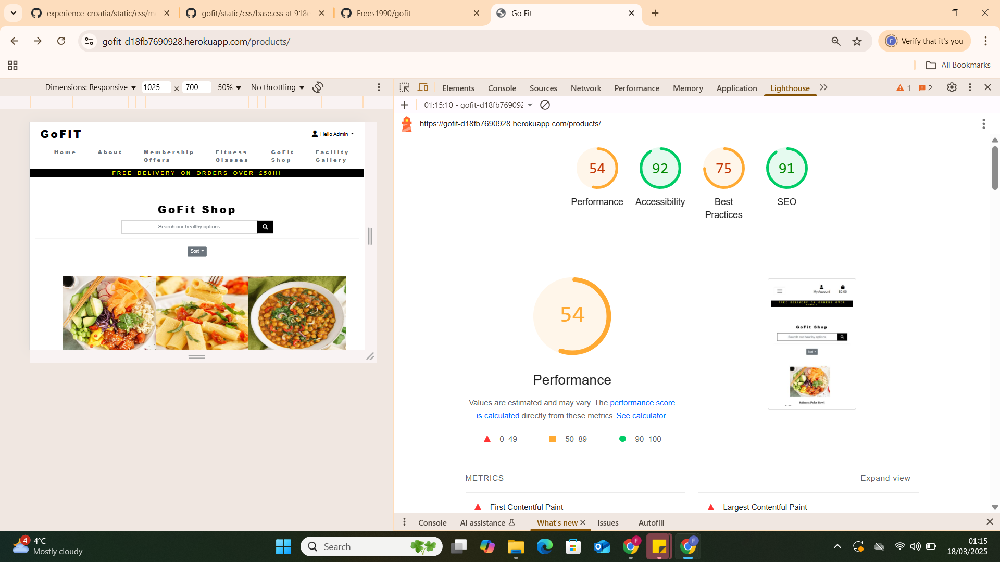 | 
| Shop          | Desktop | 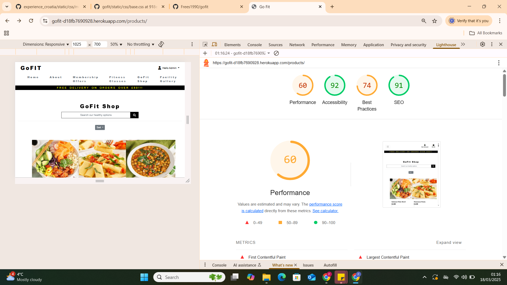 |
| Gallery          | Mobile  | 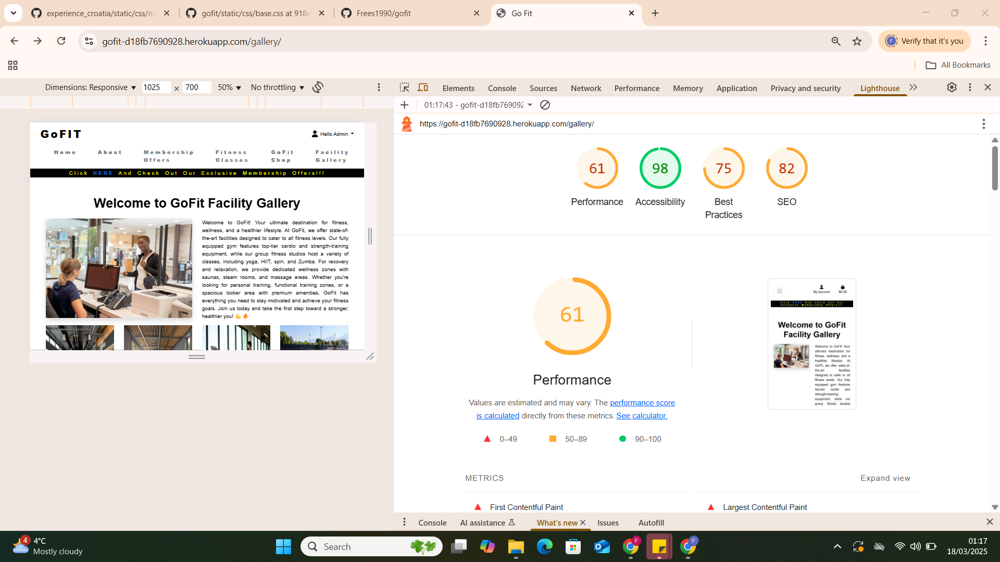 | 
| Gallery          | Desktop | 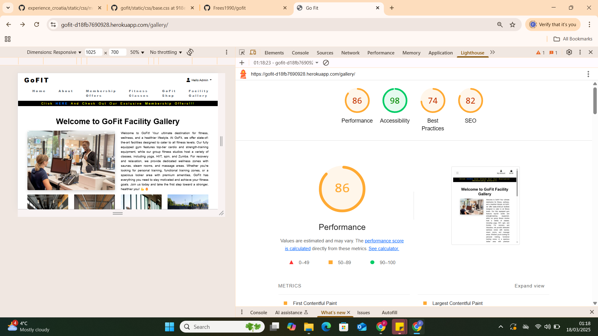 | 

## User Story Testing

| User Story                                                                                                              | Screenshot                                                  |
| ----------------------------------------------------------------------------------------------------------------------- | ----------------------------------------------------------- |
| As a new site user, I would like to quickly see the sites purpose.                                                      |                     |
| As a new site user, I would like to see clear navigation, so that I can easily move back and forward between pages.     | 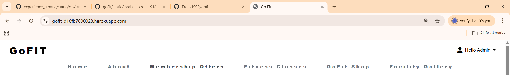               |
| As a new site user, I would like any information to be clear and to the point, so that I can make an informed decision. |                     |
| As a new site user, I would like to be able to contact the site owner for Inquiries.                                    |                  |
| As a new site user, I would like to find the sites social media pages.                                                  |                        |              |
               |
