# Testing

Return back to the [README.md](README.md) file.

## Code Validation

### HTML

I have used the recommended [HTML W3C Validator](https://validator.w3.org) to validate all of my HTML files.

| Page             | W3C URL                                                                                                    | Screenshot                                                              | Notes                               |
| ---------------- | ---------------------------------------------------------------------------------------------------------- | ----------------------------------------------------------------------- | ----------------------------------- |
| Home             | [W3C](https://validator.w3.org/nu/?doc=https%3A%2F%2Fgofit-d18fb7690928.herokuapp.com%2F   )               | 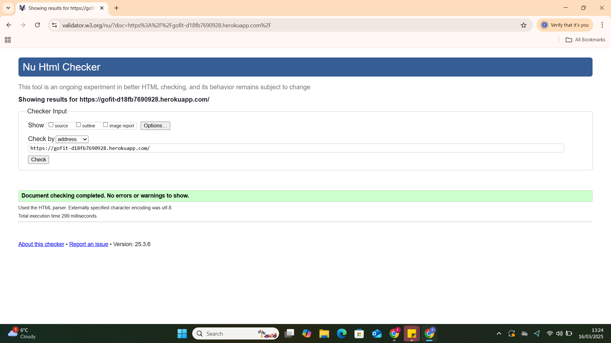                | Pass: No Errors                     |
| About            | [W3C](https://validator.w3.org/nu/?doc=https%3A%2F%2Fgofit-d18fb7690928.herokuapp.com%2Fabout%2F)         |                | Pass: No Errors     |
| Membership       | [W3C](https://validator.w3.org/nu/?doc=https%3A%2F%2Fgofit-d18fb7690928.herokuapp.com%2Fmembership%2F)              |           | Pass: No Errors |
| Fitness Classes  | [W3C](https://validator.w3.org/nu/?doc=https%3A%2F%2Fgofit-d18fb7690928.herokuapp.com%2Ffitness_classes%2F)| 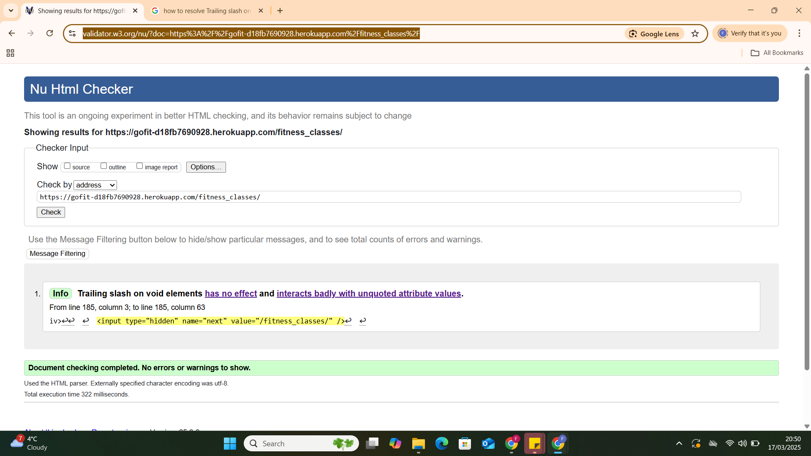          | Pass: Info: Trailing slash on void elements has no effect andErrors  |
| GoFit Shop       | [W3C](https://validator.w3.org/nu/?doc=https%3A%2F%2Fgofit-d18fb7690928.herokuapp.com%2Fproducts%2F)     |      | Pass: No Errors                     |
| Gallery          | [W3C](https://validator.w3.org/nu/?doc=https%3A%2F%2Fgofit-d18fb7690928.herokuapp.com%2Fgallery%2F)              |               | Pass: No Errors                     |
| SignUP           | [W3C](https://validator.w3.org/nu/?doc=https%3A%2F%2Fgofit-d18fb7690928.herokuapp.com%2Faccounts%2Fsignup%2F)              |               | Pass: No Errors                     |
| LogIN            | [W3C](https://validator.w3.org/nu/?doc=https%3A%2F%2Fgofit-d18fb7690928.herokuapp.com%2Faccounts%2Flogin%2F)              |               | Pass: No Errors                     |
| Membership Details| [W3C](https://validator.w3.org/nu/?doc=https%3A%2F%2Fgofit-d18fb7690928.herokuapp.com%2Fmembership%2Fdetail%2F2%2F)              |               | Pass: No Errors                     |
| Admin Add Membership | [W3C](https://validator.w3.org/nu/?doc=https%3A%2F%2Fgofit-d18fb7690928.herokuapp.com%2Fmembership%2Fadd%2F)              |               | Info: Trailing slash on void elements has no effect and Errors                     |
| Admin Edit Membership| [W3C](https://validator.w3.org/nu/?doc=https%3A%2F%2Fgofit-d18fb7690928.herokuapp.com%2Fmembership%2Fedit%2F2%2F)              | 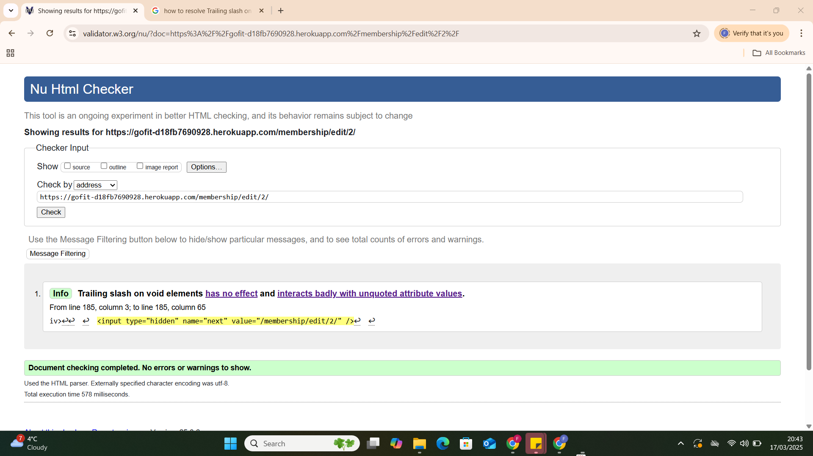              | Info: Trailing slash on void elements has no effect and Errors                     |
| Admin Add Fit Class  | [W3C](https://validator.w3.org/nu/?doc=https%3A%2F%2Fgofit-d18fb7690928.herokuapp.com%2Ffitness_classes%2Fadd%2F)              | 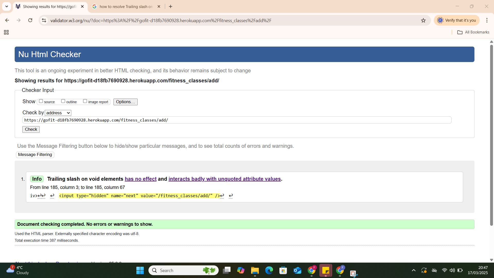              | Info: Trailing slash on void elements has no effect and Errors                     |
| Admin Edit Fit Class | [W3C](https://validator.w3.org/nu/?doc=https%3A%2F%2Fgofit-d18fb7690928.herokuapp.com%2Ffitness_classes%2Fedit%2F2%2F)              | 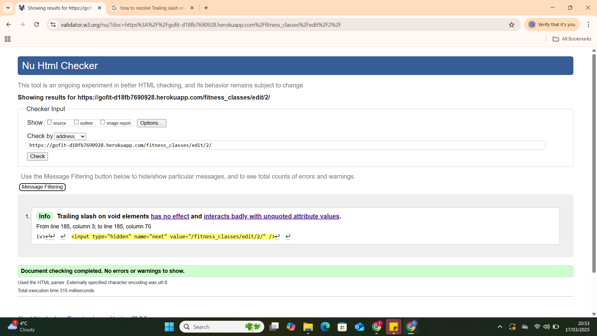              | Info: Trailing slash on void elements has no effect and Errors                     |
| Product Detail       | [W3C](https://validator.w3.org/nu/?doc=https%3A%2F%2Fgofit-d18fb7690928.herokuapp.com%2Fproducts%2Fdetail%2F16%2F)              | 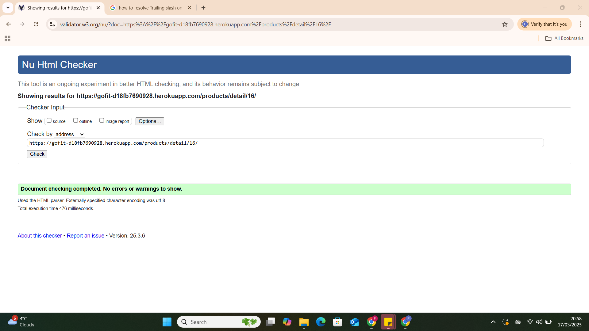              | Pass: No Errors                     |
| Admin Add Product    | [W3C](https://validator.w3.org/nu/?doc=https%3A%2F%2Fgofit-d18fb7690928.herokuapp.com%2Fproducts%2Fadd%2F)              |               |  Info: Trailing slash on void elements has no effect and Errors                     |
| Admin Edit Product   | [W3C](https://validator.w3.org/nu/?doc=https%3A%2F%2Fgofit-d18fb7690928.herokuapp.com%2Fproducts%2Fedit%2F17%2F)              | 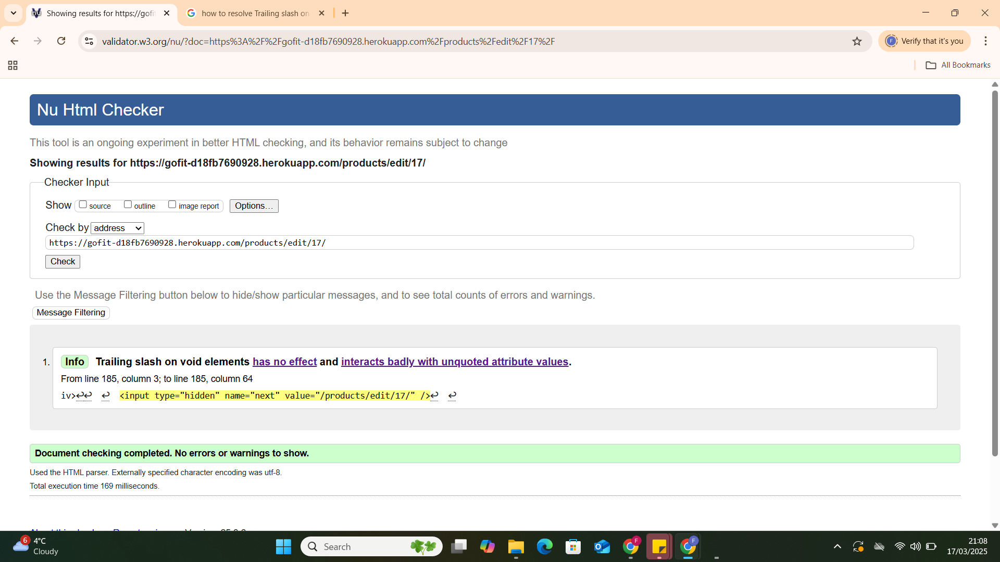              | Info: Trailing slash on void elements has no effect and Errors                     |
| Admin/User Profile   | [W3C](https://validator.w3.org/nu/?doc=https%3A%2F%2Fgofit-d18fb7690928.herokuapp.com%2Fprofile%2F)              |               | Info: Trailing slash on void elements has no effect and Errors                    |
| Shop Bag             | [W3C](https://validator.w3.org/nu/?doc=https%3A%2F%2Fgofit-d18fb7690928.herokuapp.com%2Fbag%2F)              | 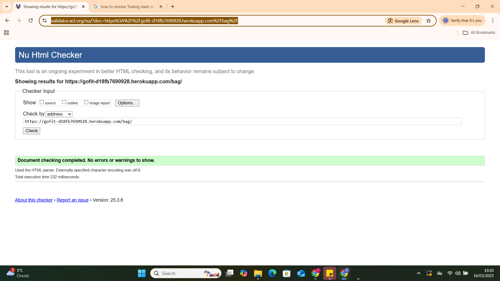              | Pass: No Errors                     |
| Checkout Bag         | [W3C](https://validator.w3.org/nu/?doc=https%3A%2F%2Fgofit-d18fb7690928.herokuapp.com%2Fcheckout%2F)              | 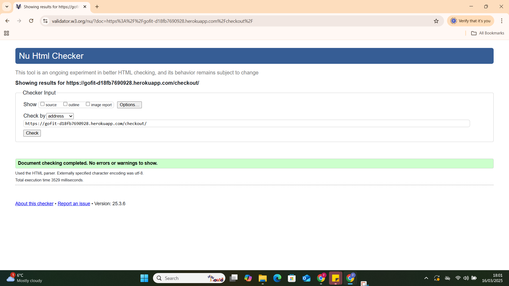              | Pass: No Errors                     |
| Checkout Success     | [W3C](https://validator.w3.org/nu/?doc=https%3A%2F%2Fgofit-d18fb7690928.herokuapp.com%2Fcheckout%2Fcheckout_success%2F3AAC9EF492AC4CCD809E9FC77074CA9F)              | 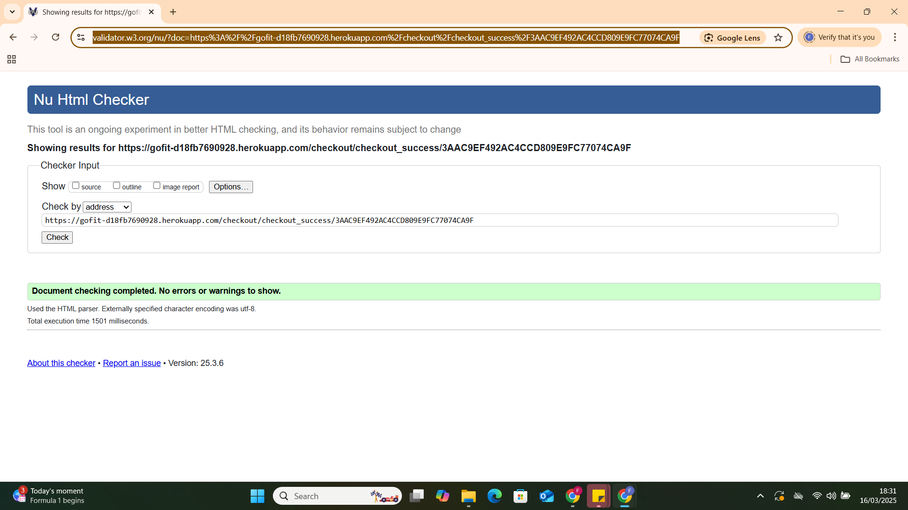              | Pass: No Errors                     |


### CSS

I have used the recommended [CSS Jigsaw Validator](https://jigsaw.w3.org/css-validator) to validate all of my CSS files.

| File      | Jigsaw URL                                                                                                       | Screenshot                                                  | Notes           |
| --------- | ---------------------------------------------------------------------------------------------------------------- | ----------------------------------------------------------- | --------------- |
| style.css | [Jigsaw](https://jigsaw.w3.org/css-validator/validator?uri=https%3A%2F%2Fgofit-d18fb7690928.herokuapp.com%2F&profile=css3svg&usermedium=all&warning=1&vextwarning=&lang=en) | 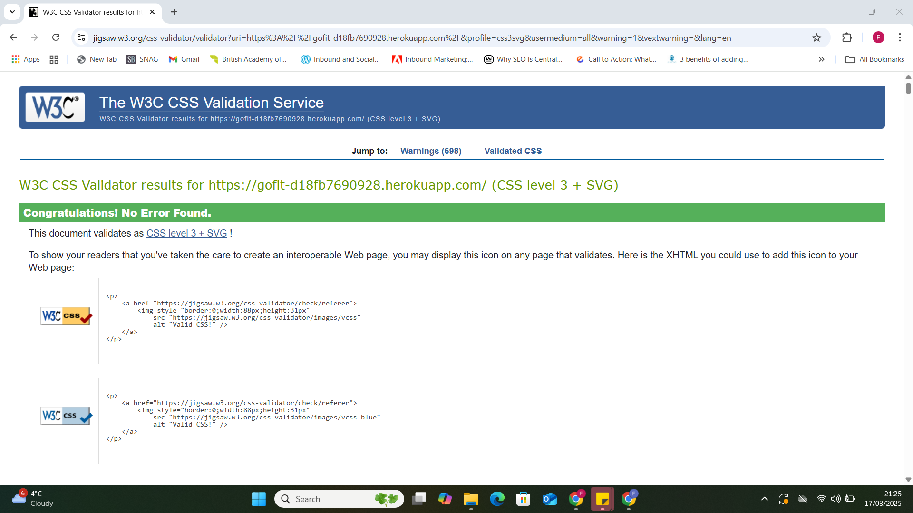 | Pass: No Errors |

## Browser Compatibility

I've tested my deployed project on multiple browsers to check for compatibility issues.

| Browser | Screenshot                                             | Screenshot                                                   | Screenshot                                                 | Screenshot                                                     | Notes             |
| ------- | ------------------------------------------------------ | ------------------------------------------------------------ | ---------------------------------------------------------- | -------------------------------------------------------------- | ----------------- |
| Edge  |   |   | 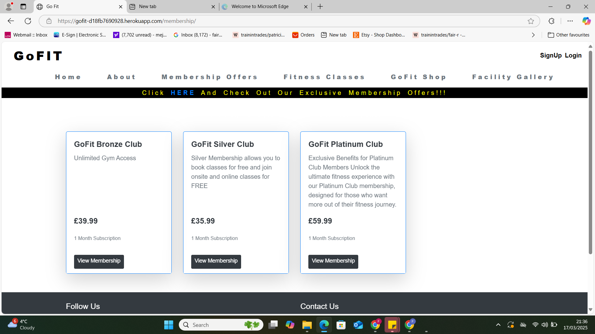  |   | Works as expected |
| Chrome    |     |     | 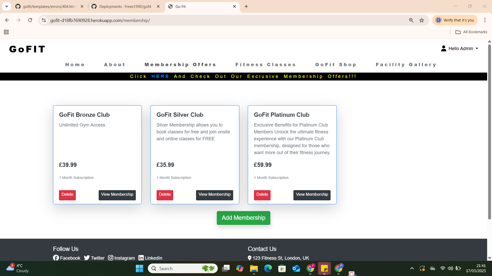    |     | Works as expected |

## Responsiveness

I've tested my deployed project on multiple devices to check for responsiveness issues.

| Device                   | Screenshot                                                          | Screenshot                                                           | Screenshot                                                         | Screenshot                                                             | Notes             |
| ------------------------ | ------------------------------------------------------------------- | -------------------------------------------------------------------- | ------------------------------------------------------------------ | ---------------------------------------------------------------------- | ----------------- |
| Mobile (DevTools)        |    |    |    |    | Works as expected |
| Tablet (DevTools)        |    |    |    |    | Works as expected |
| Desktop                  |       |       |       |       | Works as expected |
| Google Pixel 4a          |  |  |  |  | Works as expected |
| Samsung Galaxy S8        |     |     |     |     | Works as expected |
| Samsung Galaxy S21 Ultra |    |    |    |    | Works as expected |
| Samsung Galaxy tab 4     |   |   |   |   | Works as expected |

## Lighthouse Audit

I've tested my deployed project using the Lighthouse Audit tool to check for any major issues.

| Page             | Size    | Screenshot                                                        | Notes               |
| ---------------- | ------- | ----------------------------------------------------------------- | ------------------- |
| Home             | Mobile  |      | Some minor warnings |
| Home             | Desktop |     | No major problems   |
| Available Geckos | Mobile  |     | No major problems   |
| Available Geckos | Desktop |    | No major problems   |
| FAQ              | Mobile  |       | Some minor warnings |
| FAQ              | Desktop |      | No major problems   |
| Contact          | Mobile  |  | No major problems   |
| Contact          | Desktop |  | No major problems   |

## User Story Testing

| User Story                                                                                                              | Screenshot                                                  |
| ----------------------------------------------------------------------------------------------------------------------- | ----------------------------------------------------------- |
| As a new site user, I would like to quickly see the sites purpose.                                                      |                     |
| As a new site user, I would like to see clear navigation, so that I can easily move back and forward between pages.     |                |
| As a new site user, I would like any information to be clear and to the point, so that I can make an informed decision. |                     |
| As a new site user, I would like to be able to contact the site owner, so that I can make a purchase.                   |                  |
| As a new site user, I would like to find the sites social media pages.                                                  |                        |
| As a new site user, I would like to view the site on any device.                                                        |                    |
| As a returning site user, I would like to see up to date stock information.                                             |  |
| As a returning site user, I would like to refresh my knowledge by viewing fact references.                              |                     |
| As a site administrator, The code should have proper indentation so that it is clear for myself and others to read.     |                  |
| As a site administrator, The code should be properly signposted to make it easy to navigate.                            |                  |
| As a site administrator, I should be able to respond to user enquiries.                                                 |                  |

## Bugs

- Navbar not reaching page edges

  

  - To fix this, I set `padding-left` and `padding-right` to 0.
- Vertical space on right side of homepage

  

  - When implementing the 'static gallery' on the home page I initially hadn't placed a 'container' before the bootstrap row and column that the 'static gallery' was inside of. Adding this container fixed the issue.
- CSS class affecting unintended elements

  

  - I found that this class was affecting `<p>` elements that were within other classes, where my intention was to only affect the `<p>` elements within `.avail-gecko-card`. I later discovered my syntax was incorrect and fixed the problem by targeting the `<h4>` and `<p>` elements individually i.e. `.avail-gecko-card h4{}` and `.avail-gecko-card p{}` (these later became `<h3>` and `<span>`).
- Horizontal rule not centered on mobile devices

  

  - To fix this, I reduced the width of the horizontal rule as it was overflowing.
- Navbar disappearing or text flowing over it after setting position to fixed

  

  - To fix this, I set the navbar `z-index` to 1.
- Bootstrap carousel chevrons appearing above the navbar

  

  - To fix this, I set the `z-index` of the `.carousel-control-prev` and `carousel-control-next` classes to 0.
- Footer icon misalignment at 320px

  

  - To fix this, I applied the following to the css as per my mentor, Tim Nelsons advice.

  ```css
  .list-inline-item:not(:last-child) {
    margin-right: 0.4rem;
  }
  ```

## Unfixed Bugs

There are no remaining bugs that I am aware of.