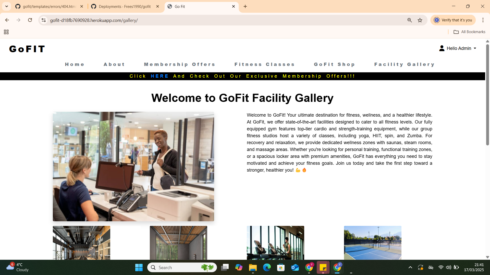
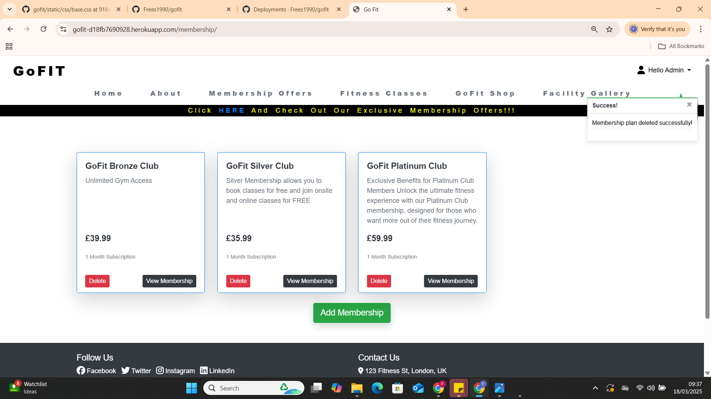
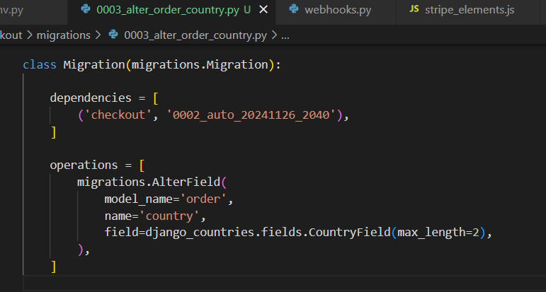

# Testing

Return back to the [README.md](README.md) file.

## Code Validation

### HTML

I have used the recommended [HTML W3C Validator](https://validator.w3.org) to validate all of my HTML files.

| Page             | W3C URL                                                                                                    | Screenshot                                                              | Notes                               |
| ---------------- | ---------------------------------------------------------------------------------------------------------- | ----------------------------------------------------------------------- | ----------------------------------- |
| Home             | [W3C](https://validator.w3.org/nu/?doc=https%3A%2F%2Fgofit-d18fb7690928.herokuapp.com%2F   )               |                 | Pass: No Errors                     |
| About            | [W3C](https://validator.w3.org/nu/?doc=https%3A%2F%2Fgofit-d18fb7690928.herokuapp.com%2Fabout%2F)         |                | Pass: No Errors     |
| Membership       | [W3C](https://validator.w3.org/nu/?doc=https%3A%2F%2Fgofit-d18fb7690928.herokuapp.com%2Fmembership%2F)              |           | Pass: No Errors |
| Fitness Classes  | [W3C](https://validator.w3.org/nu/?doc=https%3A%2F%2Fgofit-d18fb7690928.herokuapp.com%2Ffitness_classes%2F)|           | Pass: Info: Trailing slash on void elements has no effect andErrors  |
| GoFit Shop       | [W3C](https://validator.w3.org/nu/?doc=https%3A%2F%2Fgofit-d18fb7690928.herokuapp.com%2Fproducts%2F)     |      | Pass: No Errors                     |
| Gallery          | [W3C](https://validator.w3.org/nu/?doc=https%3A%2F%2Fgofit-d18fb7690928.herokuapp.com%2Fgallery%2F)              |               | Pass: No Errors                     |
| SignUP           | [W3C](https://validator.w3.org/nu/?doc=https%3A%2F%2Fgofit-d18fb7690928.herokuapp.com%2Faccounts%2Fsignup%2F)              |               | Pass: No Errors                     |
| LogIN            | [W3C](https://validator.w3.org/nu/?doc=https%3A%2F%2Fgofit-d18fb7690928.herokuapp.com%2Faccounts%2Flogin%2F)              |               | Pass: No Errors                     |
| Membership Details| [W3C](https://validator.w3.org/nu/?doc=https%3A%2F%2Fgofit-d18fb7690928.herokuapp.com%2Fmembership%2Fdetail%2F2%2F)              |               | Pass: No Errors                     |
| Admin Add Membership | [W3C](https://validator.w3.org/nu/?doc=https%3A%2F%2Fgofit-d18fb7690928.herokuapp.com%2Fmembership%2Fadd%2F)              |               | Info: Trailing slash on void elements has no effect and Errors                     |
| Admin Edit Membership| [W3C](https://validator.w3.org/nu/?doc=https%3A%2F%2Fgofit-d18fb7690928.herokuapp.com%2Fmembership%2Fedit%2F2%2F)              |               | Info: Trailing slash on void elements has no effect and Errors                     |
| Admin Add Fit Class  | [W3C](https://validator.w3.org/nu/?doc=https%3A%2F%2Fgofit-d18fb7690928.herokuapp.com%2Ffitness_classes%2Fadd%2F)              |               | Info: Trailing slash on void elements has no effect and Errors                     |
| Admin Edit Fit Class | [W3C](https://validator.w3.org/nu/?doc=https%3A%2F%2Fgofit-d18fb7690928.herokuapp.com%2Ffitness_classes%2Fedit%2F2%2F)              |               | Info: Trailing slash on void elements has no effect and Errors                     |
| Product Detail       | [W3C](https://validator.w3.org/nu/?doc=https%3A%2F%2Fgofit-d18fb7690928.herokuapp.com%2Fproducts%2Fdetail%2F16%2F)              |               | Pass: No Errors                     |
| Admin Add Product    | [W3C](https://validator.w3.org/nu/?doc=https%3A%2F%2Fgofit-d18fb7690928.herokuapp.com%2Fproducts%2Fadd%2F)              |               |  Info: Trailing slash on void elements has no effect and Errors                     |
| Admin Edit Product   | [W3C](https://validator.w3.org/nu/?doc=https%3A%2F%2Fgofit-d18fb7690928.herokuapp.com%2Fproducts%2Fedit%2F17%2F)              |               | Info: Trailing slash on void elements has no effect and Errors                     |
| Admin/User Profile   | [W3C](https://validator.w3.org/nu/?doc=https%3A%2F%2Fgofit-d18fb7690928.herokuapp.com%2Fprofile%2F)              |               | Info: Trailing slash on void elements has no effect and Errors                    |
| Shop Bag             | [W3C](https://validator.w3.org/nu/?doc=https%3A%2F%2Fgofit-d18fb7690928.herokuapp.com%2Fbag%2F)              |               | Pass: No Errors                     |
| Checkout Bag         | [W3C](https://validator.w3.org/nu/?doc=https%3A%2F%2Fgofit-d18fb7690928.herokuapp.com%2Fcheckout%2F)              |               | Pass: No Errors                     |
| Checkout Success     | [W3C](https://validator.w3.org/nu/?doc=https%3A%2F%2Fgofit-d18fb7690928.herokuapp.com%2Fcheckout%2Fcheckout_success%2F3AAC9EF492AC4CCD809E9FC77074CA9F)              |               | Pass: No Errors                     |

### CSS

I have used the recommended [CSS Jigsaw Validator](https://jigsaw.w3.org/css-validator) to validate all of my CSS files.

| File      | Jigsaw URL                                                                                                       | Screenshot                                                  | Notes           |
| --------- | ---------------------------------------------------------------------------------------------------------------- | ----------------------------------------------------------- | --------------- |
| style.css | [Jigsaw](https://jigsaw.w3.org/css-validator/validator?uri=https%3A%2F%2Fgofit-d18fb7690928.herokuapp.com%2F&profile=css3svg&usermedium=all&warning=1&vextwarning=&lang=en) |  | Pass: No Errors |

### JS
 
 

## Browser Compatibility

I've tested my deployed project on multiple browsers to check for compatibility issues.

| Browser | Screenshot                                             | Screenshot                                                   | Screenshot                                                 | Screenshot                                                     | Notes             |
| ------- | ------------------------------------------------------ | ------------------------------------------------------------ | ---------------------------------------------------------- | -------------------------------------------------------------- | ----------------- |
| Edge  |   |   |   |   | Works as expected |
| Chrome    |     |     |     |     | Works as expected |

## Lighthouse Audit

I've tested my deployed project using the Lighthouse Audit tool to check for any major issues.

| Page             | Size    | Screenshot                                                        | 
| ---------------- | ------- | ----------------------------------------------------------------- |
| Home             | Mobile  |                  | 
| Home             | Desktop |                 | 
| About            | Mobile  |                 | 
| About            | Desktop |                | 
| Membership       | Mobile  |     |
| Membership       | Desktop |                  | 
| Class          | Mobile  |  |
| Class          | Desktop |  |
| Shop          | Mobile  |  | 
| Shop          | Desktop |  |
| Gallery          | Mobile  |  | 
| Gallery          | Desktop |  | 

## User Story Testing

| User Story                                                                                                              | Screenshot                                                  |
| ----------------------------------------------------------------------------------------------------------------------- | ----------------------------------------------------------- |
| As a new site user, I would like to quickly see the sites purpose.                                                      |                     |
| As a new site user, I would like to see clear navigation, so that I can easily move back and forward between pages.     |                |
| As a new site user, I would like any information to be clear and to the point, so that I can make an informed decision. |                     |
| As a new site user, I would like to be able to contact the site owner for Inquiries.                                    |                  |
| As a new site user, I would like to find the sites social media pages.                                                  |                        |              |
               |

## CRUD TESTING
-ADMIN CREATE-READ-UPDATE-DELETE  
    This Admin functionality is also available on Fitness Class and GoFIT shop. 

## BUGS ##
- Allauth installation was not installing even with the 0.41.0 , student care was able to assist me with the providing the most updated      allauth which was the 54.0

- Image was not loading because Django's static files settings were misconfigured, specifically the STATICFILES_DIRS setting.

- Forgot to double the underscore in the views.py to show the categories, only had one underscore causing it to show an error. Had to recheck the walkthrough to compare my work and realized I missed the 2nd underscore. 

- The Sort drop down did not work, realized that I was in the wrong version of bootsrap. Changed my version from 5.0 to 4.6 and used the code from this version and the dropped down worked. 

- When trying to deploy my work to heroku I get an fail to deploy. 
    

    s3 and Iam was not configured properly due to following old video walkthrough that was no longer becuase of Amazon AWS Wesbite Changes. 

- The images in my GoFit products and Facility Gallery are not showing. 

    

    The images was loading the original images stored in media which only has its name and .png. When the website connected to AWS all the images were appended see images above. There are alphanumeric series added after the underscore and this was not the one that the website was reading causing the images not to show in the front end. 

- remove option was not working, having to look at what was missing on my code. The only thing that solved the problem  was correcting a typo on the script source.

-Stripe Payment field is not showing, this was a miss on my end, it was showing but I could not see it because it was behind the background image. I found out about it when I did a dev tools inspecting it. 

- After installing pip3 install django-countries==7.2.1 and editing the models, tried migrating and it keeps getting this error 
   
   
   
    
    googled this issue and after hours of searching I found this 

    https://stackoverflow.com/questions/8484689/django-form-database-error-value-too-long-for-type-character-varying4

- PAYMENT PROCESS WAS FAILING AND NOT COMPLETING. 
    FIXED 
    
    
    
    

    ERROR HANDLING WHEN CHECKING OUT!
    
    
